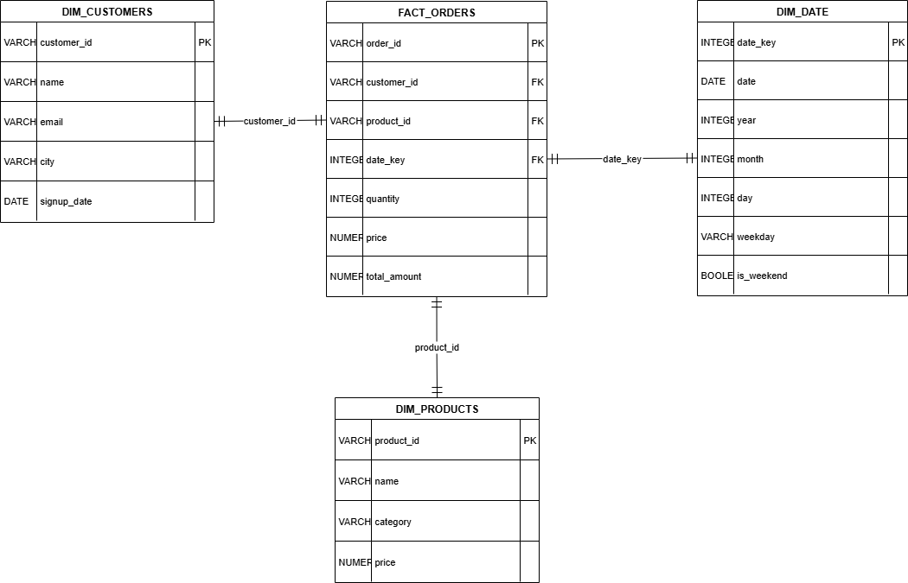

# Mini Data Warehouse — Intern Assignment (CSV-only)

## Star Schema


## How to run
All files are in the repository root or `/mnt/data` if using the bundled notebook environment.

1. Prepare raw CSVs:
   - customers_raw.csv
   - products_raw.csv
   - orders_raw.csv

2. Run the ETL script (Python 3.8+ required):
```bash
python etl_pipeline.py --raw_dir . --out_dir ./out
```

This will create:
- dim_customers.csv
- dim_products.csv
- dim_date.csv
- fact_orders.csv

3. Run SQL queries
You can run the provided `queries.sql` using DuckDB (recommended) or run the example Python notebook which uses DuckDB/pandasql to execute the queries directly against the CSVs.

## Deliverables generated
- etl_pipeline.py — ETL script
- customers_raw.csv, products_raw.csv, orders_raw.csv — sample raw data
- dim_customers.csv, dim_products.csv, dim_date.csv, fact_orders.csv — transformed tables
- queries.sql — example SQL queries
- README.md — this file

## Notes
- Dates are standardized to `YYYY-MM-DD`
- Categories are normalized to lowercase
- Missing emails are set to `unknown@example.com`
- Missing prices are treated as `0.0`
- Duplicate rows are removed during ETL
